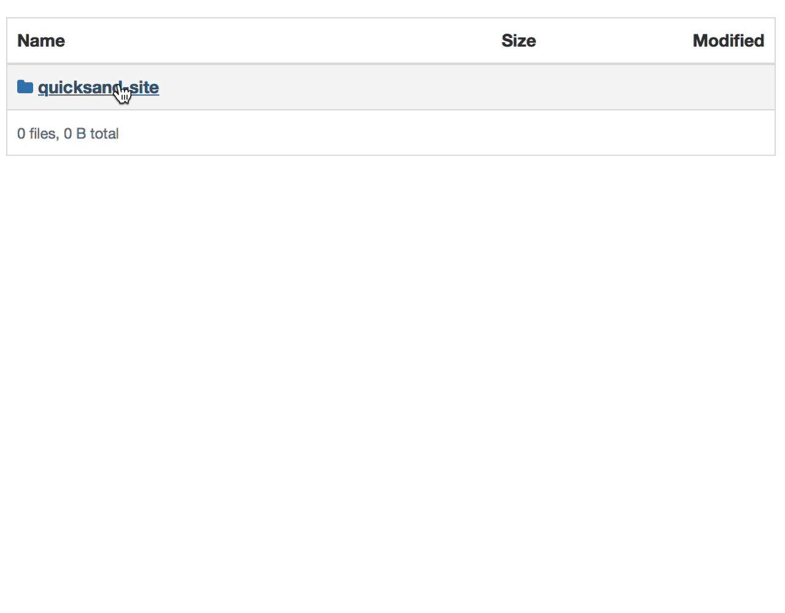
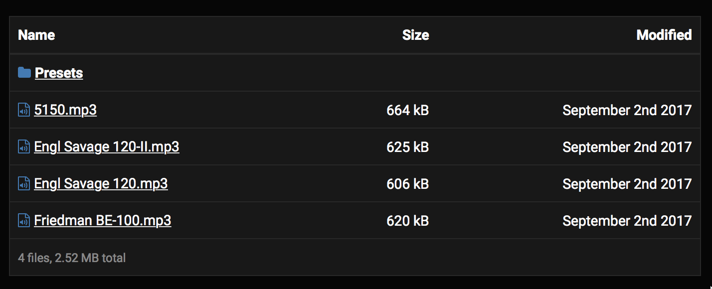

# Automatic directory listing for your S3 bucket

This project uses [Serverless framework](https://serverless.com) and AWS Lambda
to drop `index.html` to your S3 bucket whenever you upload, rename or remove
any file.



Dark theme is also supported:



## Installation

Requirements: Node.js >= 6.10,  `yarn`.

1. Install Serverless framework: `npm install -g serverless`.
2. Download this repository.
3. Install project's dependencies by running `yarn`.
4. Log in to your AWS Management Console and create credentials with admin
   access (either by going to _[your profile] → My Security credentials_, or by
   creating a new user in IAM). This project doesn't need full control of your
   AWS resources, but Serverless framework does. It's a known issue – I hope it
   will be resolved soon by the framework generating the exact policy required
   to deploy the project.
5. Install AWS CLI (eg. `brew install awscli`) and configure it with `aws
   configure`. This operation will create `~/.aws/credentials` file with
   `default` profile. I recommend renaming it to something else so that your
   default profile doesn't have full admin access.
6. `cp custom.yml.example custom.yml`. Edit `custom.yml` file and provide your
   desired configuration.
7. Deploy:

```
serverless deploy
serverless s3deploy
```

The `s3deploy` command attaches the event listener to an existing S3 bucket.
You need to run it only during the first deployment.

From now on any file you create/delete/rename on your S3 bucket will trigger
the AWS Lambda function and generate `index.html` with the directory listing in
your current directory.

## Configuring CloudFront (if applicable)

Directory listing, although statically generated by this project, has a dynamic
nature and should not be cached by your CDN. To do this, go to your CloudFront
distribution settings, select _Behaviors_ tab and create a new behavior.

For _Path Pattern_ type `*/index.html` and select custom _Object Caching_ with
the value `0` for Min TTL, max TTL and Default TTL. Now CloudFront will bypass
the cache and will always fetch fresh `index.html` file directly from your S3
bucket.

## Running the tests

```
mocha --compilers js:babel-core/register test/test.js
```
